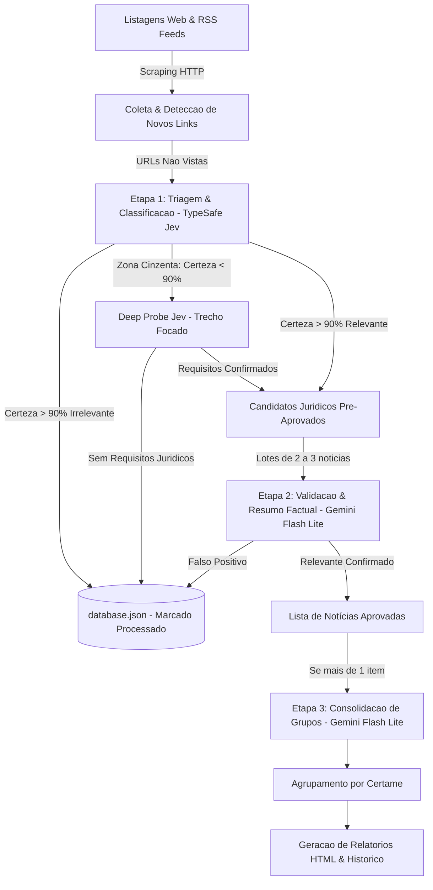

# Guia de Desenvolvimento e Arquitetura do CuradorIA (`DEVGUIDE.md`)

Este documento descreve a mecânica técnica, o fluxo de dados e os padrões arquiteturais do **CuradorIA de Carreiras Jurídicas**.

---

## 1. Visão Geral e Fluxo de Dados

O sistema opera em uma esteira diária em lote (*batch pipeline*), automatizada pelo GitHub Actions ou disparada manualmente via linha de comando.



### Ciclo de Vida da Execução

1. **Coleta:**
   - [`scraper.py`](scraper.py) raspa páginas de listagens (`TARGET_URLS`: PCI Concursos, Ache Concursos) e feeds RSS (`GOOGLE_ALERTS_FEEDS`).
   - Normaliza URLs e consulta [`database.json`](database.json). Links já conhecidos têm `last_seen` atualizado; links ausentes por 3 execuções consecutivas sofrem descarte (*decay*).
2. **Triagem e Classificação de Carreira (TypeSafe Jev - System One):**
   - Links novos são extraídos via [`extractor.py`](extractor.py).
   - Enviados para `triage_item()` em [`ai.py`](ai.py), que delega a execução para o [`typesafe_client.py`](typesafe_client.py).
   - Utiliza o modelo **Jev** (`jev-latest`) em uma única requisição de **Speculative Fan-Out** (~100 ms) avaliando 4 dimensões em paralelo (`has_legal_vacancies`, `is_exclusive_non_legal`, `is_only_legislative_citation`, `career`, `stage`).
   - Calcula o **Composite Decision Score** em código.
   - *Zona Cinzenta (< 90% de Certeza):* Dispara automaticamente o **Deep Probe** focado no excerto de requisitos do cargo, eliminando o *context rot* sem acionar outros modelos.
   - Itens claramente não jurídicos são marcados como processados no banco e descartados imediatamente com custo de frações de centavo, sem consumir cotas dos modelos analíticos generativos.
3. **Validação e Redação Factual em Lotes (Gemini Flash Lite):**
   - Notícias pré-aprovadas pelo Jev são agrupadas em lotes de 2 a 3 itens e enviadas para `evaluate_batch()`.
   - Utiliza a fila **Gemini Flash Lite** (15 RPM, 500 RPD) com modelo primário `gemini-3.5-flash-lite`.
   - Produz o resumo factual denso (`reason` de ~400 a 500 caracteres, sem clichês) e gera o slug padronizado de grupo (`group`).
4. **Consolidação de Grupos (Gemini Flash Lite):**
   - Se houver mais de 1 certame relevante no dia, `consolidate_groups()` harmoniza a taxonomia dos identificadores de grupo para que notícias do mesmo órgão/concurso fiquem unificadas no dashboard.
5. **Relatórios:**
   - [`report.py`](report.py) renderiza [`report.html`](report.html) e gera o arquivo histórico diário em `history/report-YYYY-MM-DD.html`.

---

## 2. Camada de Inteligência Artificial

### 2.1 TypeSafe Jev (`typesafe_client.py`) — Decisão Estruturada (System One)
- **Papel:** Triagem de alta velocidade, descarte imediato de notícias sem relação com Direito e pré-enquadramento da carreira jurídica.
- **Métricas:** ~100 ms de latência, cota de 1.200 RPM, custo de \$0.042 / 1M tokens de entrada (saída gratuita).
- **Composite Scoring:**
  $$\text{Score} = \text{has\_legal\_vacancies} \times (1.0 - \text{is\_exclusive\_non\_legal}) \times (1.0 - \text{is\_only\_legislative\_citation})$$
- **Deep Probe Autônomo:** Se $\text{Score}$ ou a confiança da carreira ficarem abaixo de 0.90, o cliente extrai parágrafos contendo termos de investidura/requisitos e submete a pergunta de segundo nível `requires_law_degree_explicitly`, resolvendo a ambiguidade no próprio Jev.

### 2.2 Google Gemini Flash Lite (`ai.py`) — Redação Factual e Grupos (System Two)
- **Papel:** Redação jornalística do resumo denso (`reason`) e harmonização taxonômica dos grupos (`group`).
- **Fila de Modelos:**
  `gemini-3.5-flash-lite` $\rightarrow$ `gemini-3.1-flash-lite` $\rightarrow$ `gemini-flash-lite-latest` $\rightarrow$ `gemini-2.5-flash-lite`.
- **Quotas e Pacing:**
  - 15 RPM e 500 requisições diárias (RPD).
  - Pausa mínima de segurança (*RPM pacing*) de **4.2s** entre requisições.

---

## 3. Gotchas e Decisões Críticas de Engenharia

1. **Jev Não Gera Texto Livre (Failure Mode 9):**
   - O Jev é um modelo estritamente probabilístico/estruturado (`Noul`, `Choice`, `Score`). Ele não produz prosa livre.
   - Portanto, a redação do resumo factual (`reason`) obrigatoriamente permanece com o Gemini Flash.
2. **Prevenção de *Context Rot* no Jev (Failure Mode 5):**
   - O Jev perde precisão se o `state` for inflado com páginas web longas e cheias de ruído (menus, rodapés, banners).
   - O texto enviado à triagem primária é truncado e higienizado; no Deep Probe de desempate, o `_extract_legal_snippet()` isola apenas os parágrafos relevantes contendo requisitos do cargo.
3. **Extended Thinking em Modelos Gemini:**
   - Em modelos com pensamento estendido, a API Google pode retornar blocos com `thought: true` antes do texto real.
   - `GeminiClient._extract_content()` ignora blocos marcados com `thought: true`, capturando unicamente o texto final contendo o JSON estruturado.
   - Se um modelo recusar o parâmetro `thinkingConfig` (HTTP 400), o cliente desativa o thinking e retenta imediatamente no mesmo modelo antes de passar para o fallback.
4. **Repovoamento sem IA (`--populate-only`):**
   - Caso o robô fique muito tempo sem rodar, a base de dados acumulará centenas de notícias novas.
   - O comando `python scraper.py --populate-only` sincroniza todas as URLs ativas hoje para dentro de `database.json` com **zero chamadas de IA**, restabelecendo a linha de base.
5. **Isolamento de Prompts e Limite de 500 Linhas:**
   - Para manter `ai.py` estritamente abaixo do limiar de 500 linhas, os prompts generativos vivem em [`prompts.py`](prompts.py) e o cliente Jev foi isolado em [`typesafe_client.py`](typesafe_client.py).
6. **Encoding no Console Windows:**
   - [`logger.py`](logger.py) reconfigura automaticamente `sys.stdout` para UTF-8 (`errors="replace"`), eliminando exceções de `charmap` ao imprimir caracteres Unicode (`→`, acentos, emojis).

---

## 4. Como Estender

- **Adicionar novas fontes:** Registre novas páginas em `TARGET_URLS` ou feeds em `GOOGLE_ALERTS_FEEDS` em [`config.py`](config.py).
- **Adicionar novas carreiras:** Atualize o mapeamento `CAREER_LABELS` em [`config.py`](config.py), os critérios de `career` em [`typesafe_client.py`](typesafe_client.py) e o `PROMPT_REFINEMENT_BATCH` em [`prompts.py`](prompts.py).
- **Executar a suíte de testes:**
  ```powershell
  python -m pytest
  ```
