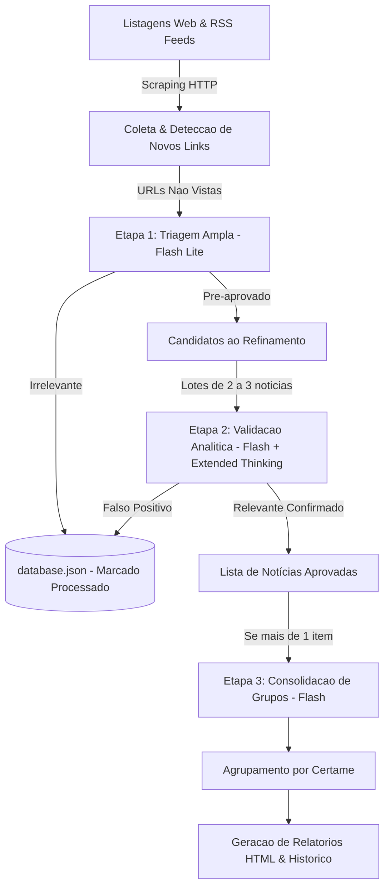

# Guia de Desenvolvimento e Arquitetura do CuradorIA (`DEVGUIDE.md`)

Este documento descreve a mecânica técnica, o fluxo de dados e os padrões arquiteturais do **CuradorIA de Carreiras Jurídicas**.

---

## 1. Visão Geral e Fluxo de Dados

O sistema opera em uma esteira diária em lote (*batch pipeline*), automatizada pelo GitHub Actions ou disparada manualmente via linha de comando.



### Ciclo de Vida da Execução

1. **Coleta:**
   - [`scraper.py`](scraper.py) raspa páginas de listagens (`TARGET_URLS`: PCI Concursos, Ache Concursos) e feeds RSS (`GOOGLE_ALERTS_FEEDS`).
   - Normaliza URLs e consulta [`database.json`](database.json). Links já conhecidos têm `last_seen` atualizado; links ausentes por 3 execuções consecutivas sofrem descarte (*decay*).
2. **Triagem Ampla (Flash Lite):**
   - Links novos são extraídos via [`extractor.py`](extractor.py).
   - Enviados individualmente para `triage_item()` em [`ai.py`](ai.py) usando a fila **Gemini Flash Lite** (15 RPM, 500 RPD).
   - *Decisão Crítica (Fail-Open):* Se houver dúvida ou falha temporária de rede, o item é mantido como candidato para garantir recall de 100%.
   - Itens claramente não jurídicos são marcados como processados no banco e descartados imediatamente, sem consumir cota dos modelos Flash.
3. **Validação e Extração Analítica em Lotes (Flash c/ Extended Thinking):**
   - Notícias pré-aprovadas são agrupadas em lotes de 2 a 3 itens e enviadas para `evaluate_batch()`.
   - Utiliza a fila **Gemini Flash** (5 RPM, 20 RPD) com modo de pensamento estendido (*Extended Thinking* / `thinkingConfig`).
   - Elimina falsos positivos com raciocínio profundo, extrai a carreira exata (`career`), produz resumo factual denso (`reason` de ~400 a 500 caracteres, sem clichês) e gera o slug de grupo (`group`).
4. **Consolidação de Grupos:**
   - Se houver mais de 1 certame relevante no dia, `consolidate_groups()` harmoniza a taxonomia dos identificadores de grupo para que notícias do mesmo órgão/concurso fiquem unificadas no dashboard.
5. **Relatórios:**
   - [`report.py`](report.py) renderiza [`report.html`](report.html) e gera o arquivo histórico diário em `history/report-YYYY-MM-DD.html`.

---

## 2. Camada de Inteligência Artificial (`ai.py` e `prompts.py`)

### Filas de Modelos e Cascata de Fallback

O cliente `GeminiClient` gerencia quotas e indisponibilidades em tempo de execução:
- **Tier Flash (Refinamento & Consolidação):**
  `gemini-3.8-flash` $\rightarrow$ `gemini-3.7-flash` $\rightarrow$ `gemini-3.6-flash` $\rightarrow$ `gemini-3.5-flash` $\rightarrow$ `gemini-3-flash-preview` $\rightarrow$ `gemini-flash-latest` $\rightarrow$ `gemini-2.5-flash`.
  *Fallback de Emergência:* se todos os Flash esgotarem cotas (HTTP 429), a requisição é automaticamente repassada para o melhor modelo disponível da fila Lite (`gemini-3.5-flash-lite`).
- **Tier Flash Lite (Triagem):**
  `gemini-3.5-flash-lite` $\rightarrow$ `gemini-3.1-flash-lite` $\rightarrow$ `gemini-flash-lite-latest` $\rightarrow$ `gemini-2.5-flash-lite`.

### Controle Proativo de Taxa (RPM Pacing)

Para evitar erros 429 proativamente:
- Modelos Lite (15 RPM): pausa mínima obrigatória de **4.2s** entre requisições.
- Modelos Flash (5 RPM): pausa mínima obrigatória de **12.5s** entre requisições.

---

## 3. Gotchas e Decisões Críticas de Engenharia

1. **Extended Thinking em Modelos Gemini:**
   - Em modelos com pensamento estendido, a API Google pode retornar partes com `thought: true` antes da resposta de texto real.
   - `GeminiClient._extract_content()` ignora explicitamente blocos marcados com `thought: true`, capturando unicamente o texto final contendo o JSON estruturado.
   - Se um modelo recusar o parâmetro `thinkingConfig` (HTTP 400), o cliente desativa o thinking e retenta imediatamente no mesmo modelo antes de passar para o fallback.
2. **Repovoamento sem IA (`--populate-only`):**
   - Caso o robô fique muito tempo sem rodar, a base de dados acumulará centenas de notícias novas.
   - O comando `python scraper.py --populate-only` sincroniza todas as URLs ativas hoje para dentro de `database.json` com **zero chamadas de IA**, restabelecendo a linha de base para os dias seguintes.
3. **Isolamento de Prompts (`prompts.py`):**
   - Para manter o `ai.py` estritamente abaixo do limiar de 500 linhas e focado em lógica, todos os templates textuais vivem em `prompts.py`.
4. **Encoding no Console Windows:**
   - `logger.py` reconfigura automaticamente `sys.stdout` para UTF-8 (`errors="replace"`), eliminando exceções de `charmap` ao imprimir caracteres Unicode (`→`, acentos, emojis).

---

## 4. Como Estender

- **Adicionar novas fontes:** Registre novas páginas em `TARGET_URLS` ou feeds em `GOOGLE_ALERTS_FEEDS` em [`config.py`](config.py).
- **Adicionar novas carreiras:** Atualize o mapeamento `CAREER_LABELS` em [`config.py`](config.py) e o `PROMPT_REFINEMENT_BATCH` em [`prompts.py`](prompts.py).
- **Executar a suíte de testes:**
  ```powershell
  python -m pytest
  ```
